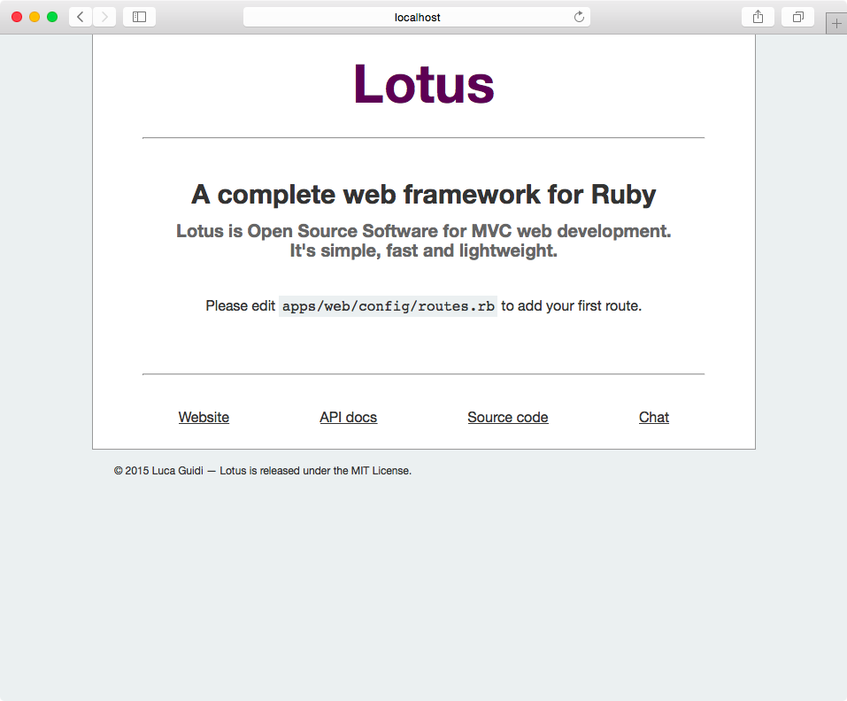

# Getting started

Set up your first Lotus project and build a simple bookshelf application. We'll
touch on all the major components of the Lotus framework, all guided by tests.

## Before we we get started

Before we get started, let's get some prerequisites out of the way. First, we're
going to assume you have basic knowledge of developing web applications with
[Ruby][]. You should also be familiar with [Bundler][], [Rake][], working with a
terminal and building apps using the [Model, View, Controller][] pattern.
Lastly, in this guide we'll be using a [PostgreSQL][] database. If you want to
follow along, make sure you have a working installation of Ruby 2.2 and
PostgreSQL 9.4 on your system.

## Create a new Lotus project

To create a new Lotus project, we need to install the Lotus gem from Rubygems.
Then we can use the new `lotus` program to initialise a new project:

```
% gem install lotusrb
% lotus new bookshelf --database postgres
```

This will create a new directory `bookshelf` in our current location, containing
our new project. Let's see what it contains:

```
% cd bookshelf
% ls
Gemfile   Rakefile  apps      config
config.ru db        lib       spec
```

Here's what you need to know:

* `apps` contains most of our web-facing application code, such as controllers,
  views, routes and templates;
* `lib` contains our business logic and domain model, including entities and
  repositories;
* `spec` contains our tests;
* `db` contains our database schema and migrations.

Go ahead and install our gem dependencie with Bundler; then you can launch a
development server:

```
% bundle install
% bundle exec lotus server
```

And... bask in the glory of your first Lotus application at
[http://localhost:2300](http://localhost:3000)! You should see a screen similar
to this:

<p></p>

## Exploring our app by passing our first test

The opening screen we see when we point our browsers at our app now, is a
built-in page used when there are no routes defined. In order to get our own,
first custom page to dispay, we'll write a high-level feature test:

```ruby
# spec/web/features/homepage_spec.rb
require 'features_helper'

describe 'Homepage' do
  it 'shows a placeholder' do
    visit '/'
    assert page.has_css?('h1', text: 'Bookshelf'), 'Title is missing'
  end
end
```

Note that, although Lotus is ready for a Test Driven Development workflow out of
the box, it is in no way bound to any particular testing framework -- nor does it
come with special integrations or libraries. We'll go with [Minitest][] here
(which is the default), but if you prefer [RSpec][] you can initialise your
project using the `--test=rspec` option. Lotus will then generate helpers and
stub files for RSpec. 

### Following a request

Now we have a test, we can see it fail by running our tests:

```
% rake test
Run options: --seed 44759

# Running:

F

Finished in 0.018611s, 53.7305 runs/s, 53.7305 assertions/s.

  1) Failure:
Homepage#test_0001_shows a placeholder [/Users/lotus/bookshelf/spec/web/features/homepage_spec.rb:6]:
Title is missing

1 runs, 1 assertions, 1 failures, 0 errors, 0 skips
```

Our test obviously failed; now let's make it pass. Follow the hint on the welcome
screen and edit `apps/web/config/routes.rb`. Uncomment the following line:

```ruby
get '/', to: 'home#index'
```

We've added our first route: we've pointed our application's root URL to the
`index` action of the `home` controller (see the [routing guide][routing] for
more information). As it turns out, this controller action already exists: it
was generated for us when we initialised our project. It lives in
`apps/web/controllers/home/index.rb`;

```ruby
module Web::Controllers::Home
  class Index
    include Web::Action

    def call(params)
    end
  end
end
```

This is an empty controller action that does nothing more than render its
accompanying view, found in `apps/web/views/home/index.erb`:

```ruby
module Web::Views::Home
  class Index
    include Web::View
  end
end
```

...which, in turn, is empty and does nothing more than render its template, found
in `apps/web/templates/home/index.html.erb`. This is the file we can edit to
make our test pass. Make it look like this:

```html
<h1>Bookshelf</h1>
```

Save your changes, run your test again and it should pass. Easy!

### Of containers and apps

Did you wonder about the `Web` constant you saw referenced in the controllers
and views? Where dit come from? Lotus uses a container architecture by default,
whereby a single project can contain multiple applications. Such applications
might include a JSON API, an admin panel, a marketing website, and so forth. All
these applications live under `apps`, with the default application being called
`web`. Lotus' core frameworks are duplicated when the container boots, so
configurations for different containers don't interfere with another.

Let's recap what we've seen so far: to get our own page on the screen, we
followed the execution path of a request in Lotus through the router into a
controller action, through a view, to a template file. You can find out more
about [routing][], [controllers][] and [views][] in their respective guides.

## Generating new actions

Let's use our new knowledge about the major Lotus components to add a custom
action. The purpose of our Bookshelf application is to manage books. We'll store
books in our database and let user the manage them with our application. A first
step would be to show a listing of all the books in our system.

Let's write a new feature test for what we want to achieve:

```ruby
# spec/web/features/list_books_spec.rb
require 'features_helper'

describe 'List books' do
  it 'displays each book on the page' do
    visit '/books'
    assert page.has_css?('.book', count: 2), 'There are no books on the page'
  end
end
```

The test is simple enough, and obviously fails because the URL `/books` is not currently recognised in our application. We'll create a new controller action to remedy that.

### Lotus generators

Lotus ships with various generators to save on typing some of the boilerplate
involved in adding new functionality. In your terminal, enter:

```
% lotus generate action web books#index
```

This will generate a new action _index_ in the _books_ controller of the _web_
application. It gives us an empty controller action, view and template; it also
adds a default route to `apps/web/config/routes.rb`:

```ruby
get '/books', to: 'book#index'
```

This is exactly the route we need. To make our test pass, we need to edit our
newly generated template file in `apps/web/templates/books/index.html.erb`:

```html
<h1>Bookshelf</h1>
<h2>All books</h2>
<div class="book">
  <h3>Brave New World</h3>
  <p>by <strong>Aldous Huxley</strong></p>
</div>
<div class="book">
  <h3>1984</h3>
  <p>by <strong>George Orwell</strong></p>
</div>
```

Save your changes and see your tests pass!

The terminology of controllers and actions might be confusing, so let's clear
this up: actions form the basis of our Lotus applications; controllers are mere
modules that group several actions together. So while the "controller" is
_conceptually_ present in our project, in practice we only deal with actions.

We've used a generator to create a new endpoint in our application. But one
thing you may have noticed is that our new template contains the same `<h1>` as
our `home/index.html.erb` template. Let's remedy that.

### Layouts

To avoid repeating ourselves in every single template, we can use a layout. Open
up the file `apps/web/templates/application.htm.erb` and edit it to look like
this:

```rhtml
<!doctype HTML>
<html>
  <head>
    <title>Web</title>
  </head>
  <body>
    <h1>Bookshelf</h1>
    <%= yield %>
  </body>
</html>
```

Now you can remove the duplicate lines from the other templates.

A **layout** is a view like any other view, but it is used to wrap your regular
templates. The `yield` line is replaced with the contents of our regular
template. It's the perfect place to put our repeating headers and footers.

## Modeling our data with entities

Hard-coding books in our templates is, admittedly, kind of cheating. Let's add
some dynamic data to our application. We'll store books in our database and
display them on our page. To do so, we need a way to read and write to our
database. Enter entities and repositories:

* an **entity** is a domain object defined by its identity;
* a **repository** mediates between entities and the persistence layer.

You might be familiar with the [active record][] pattern for ORMs, but
Lotus::Model uses the [data mapper][] pattern. Read more about entities and
repositories in the [Lotus Model guide][models]. Lotus ships with a generator
for models, so let's use it create a `Book` model:

```
% lotus generate model Book
create  lib/bookshelf/entities/book.rb
create  lib/bookshelf/repositories/book_repository.rb
create  spec/bookshelf/entities/book_spec.rb
create  spec/bookshelf/repositories/book_repository_spec.rb
```

The generator gives us an entity, repository and accompanying test files.

### Working with entities

An entity is only as useful as its attributes, so let's add some:

```ruby
# lib/bookshelf/entities/book.rb
class Book
  include Lotus::Entity
  attributes :title, :author, :created_at, :updated_at
end
```

This has added some simple readers and writers to our class. We can verify it
all works as expected with a unit test:

```ruby
# spec/bookshelf/entities/book_spec.rb
require 'spec_helper'

describe Book do
  it 'can be initialised with attributes' do
    book = Book.new(title: '1984')
    book.title.must_equal '1984'
  end
end
```

### Using repositories

We can use repositories to load and write entities to our databse. Of course, in
order for that to work, we need to set up our database. If you initialised the
project with the `--database postgres`, your application is pre-configured for
using a PostgreSQL database. The configuration for what database to use lives in
a special hidden configuration file in the root of the project: `.env` for
production, `.env.development` of development mode and `.env.test` for when you
are running tests. For example, review `.env.development`:

```
# Define ENV variables for development environment
BOOKSHELF_DATABASE_URL="postgres://localhost/bookshelf_development"
WEB_DATABASE_URL="file:///db/web_development"
WEB_SESSIONS_SECRET="21aec7f7371228dd0d4da6a620a1a6b22889edcf0d4fb1c11b8080cd87146eda"
```

The database configured by default, called `bookshelf_development` running on
`localhost`, should work fine for now. Lotus can create the database for us:

```
% lotus db create
```

### Migrations to change our database schema

Next, we need a table in our database to hold our book data. We can use a
**migration** to make the required changes. Use the migration generator to
create an empty migration:

```
% lotus generate migration create_books
```

This gives us a file named like `db/migrations/20150616120629_create_books.rb`
that we can edit:

```ruby
Lotus::Model.migration do
  change do
    create_table :books do
      primary_key :id
      column :title, String, null: false
      column :author, String, null: false
      column :created_at, DateTime, null: false
      column :updated_at, DateTime, null: false
    end
  end
end
```

Lotus provides a DSL to describe changes to our database schema. You can read more
about how migrations work in the [announcement on the Lotus
blog][migrations-announcement]. In this case, we define a new table with columns
for each of our entitie's attributes. Let's apply these changes to our database:

```
% lotus db migrate
```

Finally, we need to tell Lotus how to map entity attributes to database columns
-- with respect to both their _names_ and their _types_. Go ahead and open up
`lib/bookshelf.rb`; in this file you'll find most of the project-wide
configuration for `Lotus::Model`, including a section on mapping. Edit the
commented-out example:

```ruby
# lib/bookshelf.rb
mapping do
  collection :books do
    entity     Book
    repository BookRepository
    attribute :id,         Integer
    attribute :title,      String
    attribute :author,     String
    attribute :created_at, DateTime
    attribute :updated_at, DateTime
  end
end
```  

### Playing with the repository

With our mapping set up, we are ready to play around with our repository. We can
use Lotus' `console` command to launch irb with our application pre-loaded, so we
can use our objects:

```
% lotus console
>> BookRepository.all
=> []
>> book = Book.new(title: '1984', author: 'George Orwell')
=> #<Book:0x007f9af1d4b028 @title="1984", @author="George Orwell">
>> BookRepository.create(book)
=> #<Book:0x007f9af1d13ec0 @title="1984", @author="George Orwell", @created_at=#<DateTime: 2015-06-17T18:37:56+00:00 ((2457191j,67076s,175853000n),+0s,2299161j)>, @id=1>
>> BookRepository.find(1)
=> #<Book:0x007f9af1d13ec0 @title="1984", @author="George Orwell", @created_at=#<DateTime: 2015-06-17T18:37:56+00:00 ((2457191j,67076s,175853000n),+0s,2299161j)>, @id=1>
```

Lotus repositories have methods to load one or more entities from our database;
and to create and update existing records. The repository is also the place
where you would define new methods to implement custom queries.

To recap, we've seen how Lotus uses entities and repositories to model our data.
Entities represent our data, while repositories use mappings to translate our
entities to our data store. We can use migrations to apply changes to our
database schema.

### Displaying dynamic data

With our new experience with modelling data, we can get to work displaying
dynamic data on our book listing page. Let's adjust the feature test we created
earlier:

```
# spec/web/features/list_books_spec.rb
require 'features_helper'

describe 'List books' do
  after do
    BookRepository.clear
  end

  it 'shows a book element for each book' do
    BookRepository.create(Book.new(title: '1984', author: 'George Orwell'))
    BookRepository.create(Book.new(title: 'Brave New World', author: 'Aldous Huxley'))
    visit '/books'
    assert page.has_css?('.book', count: 2), 'Did not find 2 book elements'
  end
end
```

We actually create the required records in our test and then assert the correct
number of book classes on the page. When we run this test, we will most likely
see an error from our database connection -- remember we only migrated our
_development_ database, and not yet our _test_ database. Its connction strings
is defined in `.env.test` and here's how you set it up:

```
% LOTUS_ENV=test lotus db create
% LOTUS_ENV=test lotus db migrate
```

Now we can go change our template and remove the static HTML. Our view needs to
loop over all available records and render them. Let's write a test to force
this change in our view:

```ruby
require 'spec_helper'
require_relative '../../../../apps/web/views/books/index'

describe Web::Views::Books::Index do
  let(:exposures) { Hash[books: []] }
  let(:template)  { Lotus::View::Template.new('apps/web/templates/books/index.html.erb') }
  let(:view)      { Web::Views::Books::Index.new(template, exposures) }

  it "exposes #books" do
    view.books.must_equal exposures.fetch(:books)
  end

  describe 'when there are no books' do
    it 'shows a placeholder message' do
      view.render.must_include('<p class="placeholder">There are no books yet.</p>')
    end
  end

  describe 'when there are books' do
    let(:book1)     { Book.new(title: '1984', author: 'George Orwell') }
    let(:book2)     { Book.new(title: 'Brave New World', author: 'Aldous Huxley') }
    let(:exposures) { Hash[books: [book1, book2]] }

    it 'lists them all' do
      rendered = view.render
      rendered.scan(/class="book"/).count.must_equal 2
      rendered.must_include('1984')
      rendered.must_include('Brave New World')
    end

    it 'hides the placeholder message' do
      view.render.wont_include('<p class="placeholder">There are no books yet.</p>')
    end
  end
end
```

We specify that our index page will show a simple placeholder message when there
are no books to display; when there are, it lists every one of them. Note how
rendering a view with some data is relatively straight-forward. Lotus is
designed around simple objects with minimal interfaces that are easy to test in
isolation, yet still work great together.

Let's rewrite our template to implement these requirements:

```rhtml
<% if books.any? %>
  <% books.each do |book| %>
    <div class="book">
      <h2><%= book.title %></h2>
      <p><%= book.author %></p>
    </div>
  <% end %>
<% else %>
  <p class="placeholder">There are no books yet.</p>
<% end %>
```

If we run our feature test now, we'll see it fails — because our controller
action does not actually expose the books to our view. We can write a test for
that change:

```ruby
require 'spec_helper'

describe Web::Controllers::Books::Index do
  let(:action) { Web::Controllers::Books::Index.new }
  let(:params) { Hash[] }

  it "is successful" do
    response = action.call(params)
    response[0].must_equal 200
  end

  it 'exposes all books' do
    action.call(params)
    action.exposures[:books].must_equal []
  end
end
```

Writing tests for controller actions is basically two-fold: you either assert on
the response object, which is a Rack-compatible array of status, headers and
content; or on the action itself, which will contain exposures after you've
called it. Now we've specified that the action exposes `:books`, we can
implement our action:

```ruby
module Web::Controllers::Books
  class Index
    include Web::Action

    expose :books

    def call(params)
      @books = BookRepository.all
    end
  end
end
```

By using the `expose` method in our action class, we can expose the contents of
our `@books` instance variable to the outside world, so that Lotus can assign it
to the view. That's enough to make all our tests pass again!

## Improving our templates with presenters

We've seen how we can load entities from our database in our controllers, assign
them to our views and render them in our templates. Let's take this one step
further and display a fancy formatted date with our books.

Here's a test for what we're looking for:

```ruby
# spec/web/views/books/index_spec.rb
let(:book1) { Book.new(title: '1984', author: 'George Orwell', created_at: DateTime.new(2015, 2, 23) }
let(:book2) { Book.new(title: 'Brave New World', author: 'Aldous Huxley', created_at: DateTime.new(2015, 2, 23)) }

it 'includes nicely formatted creation dates' do
  view.render.must_include('<time>23 Feb, 2015</time>')
end
```

To make this work, we could adjust our template:

```rhtml
<div class="book">
  <h2><%= book.title %></h2>
  <p><%= book.author %></p>
  <time><%= book.created_at.strftime('%d %b, %Y') %></time>
</div>
```

...but this is hardly the proper responsibility of a _template_. We could move it
to the view, as methods in our view are available in our templates:

```ruby
# apps/web/views/books/index.rb
module Web::Views::Books
  class Index
    include Web::View
    
    def formatted_created_at(book)
      book.created_at.strftime('%d %b, %Y')
    end
  end
end
```

...but really, once we start displaying books in different views, this quickly
gets out of hand. Of course, we could contemplate moving this method to our
entity itself... but remember that this is _presentation logic_. What we need is
a presenter: a special decorator object for view helpers that wraps our `Book`
entity. Let's create a new presenter:

```ruby
# spec/web/presenters/book_presenter_spec.rb
require 'spec_helper'

describe Web::Presenters::BookPresenter do
  let(:book) { Book.new(created_at: DateTime.new(2015, 2, 23)) }
  let(:decorated_book) { Web::Presenters::BookPresenter.new(book) }

  it 'formats the creation date' do
    decorated_book.created_at.must_equal '23 Feb, 2015'
  end
end

# apps/web/presenters/book_presenter.rb
module Web::Presenters
  class BookPresenter
    include Lotus::Presenter

    def created_at
      super.strftime('%d %b, %Y')
    end
  end
end
```

### On loading code

Your test will fail, because Lotus does not by default load files in the
`apps/web/presenters` directory. Add this directory to the list of load
paths in the "web" application's configuration:

```ruby
# apps/web/application.rb
load_paths << [
  'controllers',
  'views',
  'presenters'
]
```

Lotus does not provide fancy autoloading of classes. Instead, it loads all it
needs to load at launch -- which is undeniably slower in big applications, but
is consistent across environments. Lotus does, however, take care to load _as
little code as possible_: _everything_ is loaded when you launch a server or
console, while _only the framework and its configuration_ are loaded when you
run unit tests. This allows you to have simplicity _and_ speedy tests.

### Applying presenters

By including `Lotus::Presenter` in our class, we can refer to the decorated
object (our entity) using `super`. This allows us to "override" our entities'
methods and enhance them with presentation logic. To use our decorator in our
templates, we need to tweak our view to decorate our exposed `books` method:

```ruby
# spec/web/views/books/index_spec.rb
it 'decorates books with a presenter' do
  view.books.first.must_be_instance_of Web::Presenters::BookPresenter
end

# apps/web/views/books/index.rb
module Web::Views::Books
  class Index
    include Web::View

    def books
      locals[:books].map do |book|
        Web::Presenters::BookPresenter.new(book)
      end
    end
  end
end
```

With our presenter in place, we can keep our template simple:

```rhtml
<div class="book">
  <h2><%= book.title %></h2>
  <p><%= book.author %></p>
  <time><%= book.created_at %></time>
</div>
```

[Presenters][] are a great way to organise your presentation logic. One especially
nice feature of `Lotus::Presenter` is that it handles escaping it's methods'
output. That way, your methods are HTML-safe by default.

## Buiding forms to create records

One of the last steps that remains to us is to actually make it possible to enter new books into the system. The plan is simple: we build a page with a form to enter details. When the user submits the form, we build a new entity, save it, and redirect the user back to the book listing. Here's that story expressed in a test:

```ruby
# spec/web/features/add_book_spec.rb
require 'features_helper'

describe 'Books' do
  after do
    BookRepository.clear
  end

  it 'can create a new book' do
    visit '/books/new'
    fill_in 'Title', with: 'New book'
    fill_in 'Author', with: 'Some author'
    click_button 'Create'
    current_path.must_equal('/books')
    assert page.has_content?('New book')
  end
end
```

### Laying the foundations for our form

By now, you should be familiar with the working of actions, views and templates.
We'll speed things up a little, so we can quickly get to the good parts. First,
create a new action for our "New Book" page:

```
% lotus generate action web books#new
```

Tweak the generated route to match on the `/books/new` URL, rather than just
`/books`:

```ruby
# apps/web/config/routes.rb
get 'books/new', to: 'books#new'
```

The interesting bit will be our `books/new` template, because we'll be using
Lotus' form builder to construct an HTML form around our `Book` entity. This is
what we expect from our template:

```ruby
# spec/web/views/books/new_spec.rb
let(:exposures) { Hash[params: Lotus::Action::Params.new({})] }

it 'contains a form to POST to /books' do
  view.render.must_include('<form action="/books" method="POST"')
end

it 'contains form fields for the book title and author' do
  rendered = view.render
  rendered.must_include('<input type="text" name="book[title]"')
  rendered.must_include('<input type="text" name="book[author]"')
end
```

Note how we expect a form with a specific target URL according to REST
conventions, and fields with specifically formatted names so we can parse them
as a nested hash on the subsequent request.

### Using form builders

Let's use Lotus' [form builder][] to build this form in `apps/web/templates/books/new.html.erb`:

```rhtml
<h2>Add book</h2>

<%=
  form_for :book, "/books" do
    text_field :title
    text_field :author
    submit 'Create Book'
  end
%>
```

`form_for` provides a DSL in its block to generate appropriately named and
populated form fields. This code should be enough to make our test pass, but we
can do a little better:

```rhtml
<h2>Add book</h2>

<%=
  form_for :book, "/books" do
    div class: 'input' do
      label :title
      text_field :title
    end
    div class: 'intput' do
      label :author
      text_field :author
    end
    div class: 'controls' do
      submit 'Create Book'
    end
  end
%>
```

We've added `<label>` tags for our form fields, and wrapped each field in a
container `<div>` using Lotus' [HTML builder helper][html-helper].

You might wonder why we generate markup using an HTML helper, rather than
relying more on ERb to interweave HTML and Ruby code. To do so would require
Lotus to monkeypatch how Erb works (like other frameworks do), and Lotus prefers
to avoid such patches of other libraries and Ruby's standard library when it
can. You can find our more about the form builder and its design in the [form
builder announcement blog post][forms].

### Submitting our form

To submit our form, we need yet another action. Let's create a `books#create` action:

```
% lotus generate action web books#create --skip-view
```

Notice the addition of the `--skip-view` argument to indicate we don't want to
generate a view and template here — our create action will either redirect the
user when it's done, or it will re-render our `books#new` view.

We also need to tweak the route that was created for us by default. Open up
`apps/web/config/routes.rb` and change the line that reads:

```ruby
get '/books', to: 'books#create'
```

...into:

```ruby
post '/books', to: 'books#create'
```

This changes our route to no longer match on incoming GET requests, but only POST requests.

### Implementing the create action

Our `books#create` action needs to do two things. Let's express them as unit tests:

```ruby
# spec/web/controllers/books/create_spec.rb
let(:params) { Hash[book: { title: '1984', author: 'George Orweel' }] }

after do
  BookRepository.clear
end

it 'creates a new Book' do
  action.call(params)
  BookRepository.all.count.must_equal 1
end

it 'redirects the user to the books listing' do
  response = action.call(params)
  response[0].must_equal 302
  response[1]['Location'].must_equal '/books'
end
```

Making these tests pass is easy enough. We've already seen how we can write
entities to our database, and we can use `redirect_to` to implement our
redirection:

```ruby
# apps/web/controllers/books/create.rb

def call(params)
  BookRepository.create(Book.new(params[:book]))
  redirect_to '/books'
end
```

This minimal implementation should suffice to make our tests pass.
Congratulations!

### Securing our form with validations

Hold your horses! We need some extra measures to build a truly robust form.
Imagine what would happen if the were to submit the form without entering any
values? We would see an exception from our database, essentially complaining
that we were trying to write a `null` value to a non-nullable column. We clearly
need a way of keeping invalid data out of our system!

To express our validations in a test, we need to wonder: what _would_ happen if
our validations failed? One option would be to re-render the `books#new` form,
so we can give our users another shot at completing it correctly. Let's specify
this behaviour as unit tests:

```ruby
# spec/web/apps/controllers/books/create_spec.rb
describe 'with valid params' do
  let(:params) { Hash[book: { title: '1984', author: 'George Orweel' }] }

  it 'creates a new Book' do
    action.call(params)
    BookRepository.all.count.must_equal 1
  end

  it 'redirects the user to the books listing' do
    response = action.call(params)
    response[0].must_equal 302
    response[1]['Location'].must_equal '/books'
  end
end

describe 'with invalid params' do
  let(:params) { Hash[book: {}] }

  it 're-renders the books#new view' do
    response = action.call(params)
    response[0].must_equal 200
    response[2].first.must_include('<form action="/books" method="POST"')
  end
end
```

Now our tests specify two alternative scenario's: our original happy path, and a new scenario in which validations fail. To make our tests pass, we need to implement validations.

Although you can add validation rules to the entity, Lotus also allows you to define validation rules as close to the source of the input as possible, i.e. the controller. Lotus controller actions can use the `params` class method to define acceptable incoming parameters:

```ruby
# apps/web/controllers/books/create.rb
params do
  param :book do
    param :title, presence: true
    param :author, presence: true
  end 
end

def call(params)
  BookRepository.create(Book.new(params[:book]))
  redirect_to '/'
end
```

This approach both whitelists what params are used (others are discarded to prevent mass-assignment vulnerabilities from untrusted user input) _and_ adds rules to define what values are acceptable — in this case we've specified that the nested attributes for a book's title and author should be present.

With our validations in place, we can limit our entity creation and redirection to cases where the incoming params are valid:

```ruby
# apps/web/controllers/books/create.rb

def call(params)
  if params.valid?
    BookRepository.create(Book.new(params[:book]))
    redirect_to '/'
  end
end
```

With that check in place, we are ready to provide the alliterative path: to render the `Books::New` view again in case of validation failure:

```ruby
# apps/web/controllers/books/create.rb

def call(params)
  if params.valid?
    BookRepository.create(Book.new(params[:book]))
    redirect_to '/'
  else
    self.body = Web::Books::New.render(exposures)
  end
end
```

Note how we can explicitly assign the response body of our controller action's response using `self.body=`. It's only when we leave this attribute blank that Lotus fall back to its default rendering policy to look up and render a view with the same name as the controller action.

This approach will work nicely because Lotus' form builder is smart enough to introspect the `params` in this action and populate the form fields with values found in the params. If the user fills in only one field before submitting, he is presented with his original input, saving him some frustration of typing his original input again.

Run your tests again and see they are all passing again!

You can read more about the design philosophy behind Lotus' validations in the [validations announcement blog post][validations].

### Displaying validation errors

Rather than just shoving the user a form under his nose when something has gone wrong, we should give him a hint of what's expected of him. Let's adapt our form to show a notice about invalid fields.

First, we expect a list of errors to be included in the page when `params` contains errors:

```ruby
# spec/web/views/books/new_spec.rb
let(:params)    { Lotus::Action::Params.new({}) }
let(:exposures) { Hash[params: params] }

it 'displays list of errors when params contains errors' do
  params.errors.add :title, Lotus::Validations::Error.new(:title, :presence, nil, nil)
  rendered = view.render
  rendered.must_include('There was a problem with your submission')
  rendered.must_include('title is required')
end
```

In our template we can loop over `params.errors` (if there are any) and display a friendly message. Open up `apps/web/templates/books/new.html.erb`:

```rhtml
<% if params.errors.any? %>
  <div class="errors">
    <h3>There was a problem with your submission</h3>
    <ul>
      <% params.errors.each do |error| %>
        <li><%= error.attribute_name %> is required</li>
      <% end %>
    </ul>
  </div>
<% end %>
```

As you can see, in this case we simply hard-code the error message "is
required", but you could inspect the error and customise your message per type
of validation that failed. That is, however, left as an exercise to the reader.

### Improving our use of the router

The last improvement we are going to make, is in the use of our router. Open up
the routes file for the "web" application:

```ruby
# apps/web/config/routes.rb
post '/books', to: 'books#create'
get '/books/new', to: 'books#new'
get '/books', to: 'books#index'
get '/', to: 'home#index'
```

Lotus provides a convenient helper method to build these REST-style routes, that
we can use to simplify our router a bit:

```ruby
resources :books
get '/', to: 'home#index'
```

To get a sense of what routes are defined, now we've made this change, you can
use the special command-line task `routes` to inspect the end result:

```
% lotus routes
          GET, HEAD  /                Web::Controllers::Home::Index 
    books GET, HEAD  /books           Web::Controllers::Books::Index
 new_book GET, HEAD  /books/new       Web::Controllers::Books::New  
    books POST       /books           Web::Controllers::Books::Create
     book GET, HEAD  /books/:id       Web::Controllers::Books::Show 
edit_book GET, HEAD  /books/:id/edit  Web::Controllers::Books::Edit 
     book PATCH      /books/:id       Web::Controllers::Books::Update
     book DELETE     /books/:id       Web::Controllers::Books::Destroy
```

The output for `lotus routes` shows you the name of the defined helper method
(you can suffix this name with `_path` or `_url` and call it on the `routes`
helper), the allowed HTTP method, the path and finally the controller action
that will be used to handle the request.

Now we've applied the `resources` helper method, we can take advantage of the
named route methods. Remember how we built our form using `form_for`?

```rhtml
<%=
  form_for :book, "/books" do
    # ...
  end
%>
```

It's silly to include a hard-coded path in our template, when our router already
is perfectly aware of the route to point the form to. We can use the `routes`
helper method that is available in our views and actions to access
route-specific helper methods:

```rhtml
<%=
  form_for :book, routes.books_path do
    # ...
  end
%>
```

We can make a similar change in `apps/controllers/books/create.rb`:

```ruby
redirect_to routes.books_path
```

## Wrapping up

Congratulations for completing your first Lotus project. Let's review what we've
done: we've traces requests through Lotus' major frameworks to understand how
they relate to each other; we've seen how we can model our domain using entities
and repositories; we've seen solutions for building forms, maintaining our
database schema, organising presentation logic and validating user input.

We've come a long way, but there's still plenty more to explore. Explore the
[other guides][guides], the [Lotus API documentation][docs], read the [source
code][github] and follow the [blog][]. Above all, enjoy building amazing things!

[Bundler]: http://gembundler.io
[Rake]: http://rake
[Model, View, Controller]: http://mvc
[Ruby]: http://ruby-lang.org
[PostgreSQL]: http://postgres.org
[routing]: ...
[controllers]: ...
[views]: ...
[models]: ...
[migrations-announcement]: ...
[forms]: ...
[html-helper]: ...
[form builder]: ...
[validations]: ...
[Minitest]: ...
[Capybara]: ...
[RSpec]: ...
[Presenters]: ...
[blog]: ...
[docs]: ...
[guides]: ...
[active record]: ...
[data mapper]: ...
